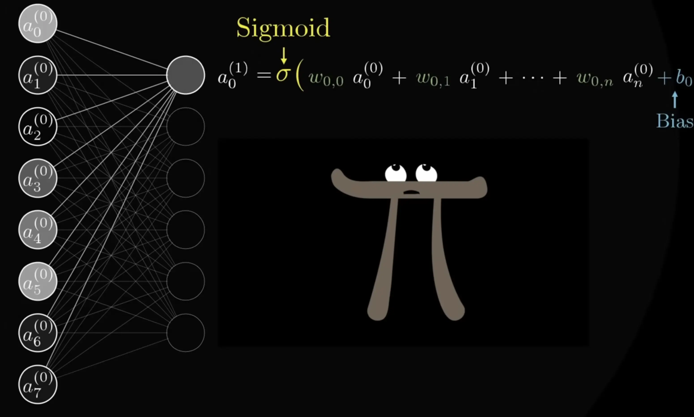
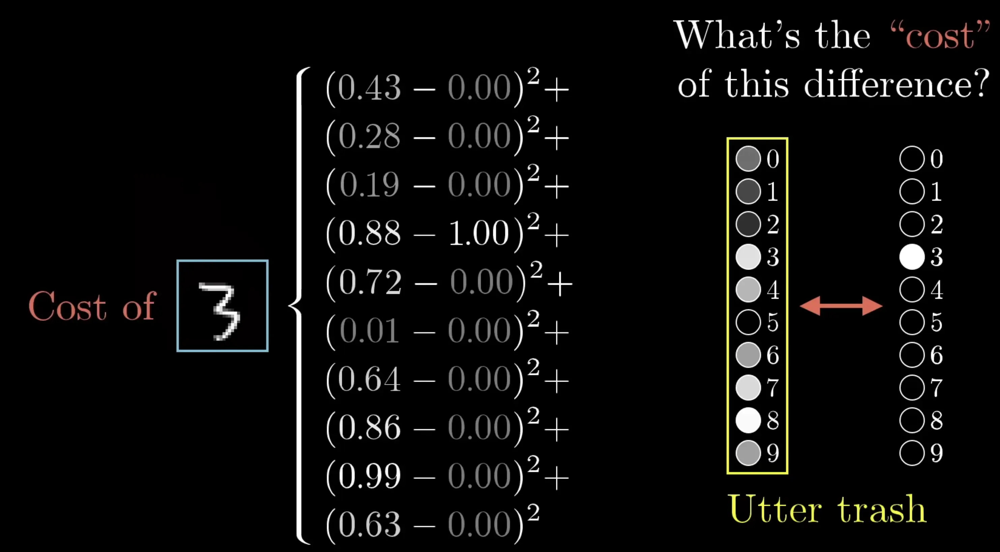
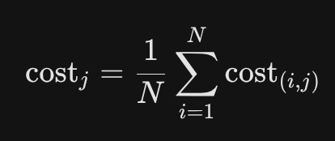
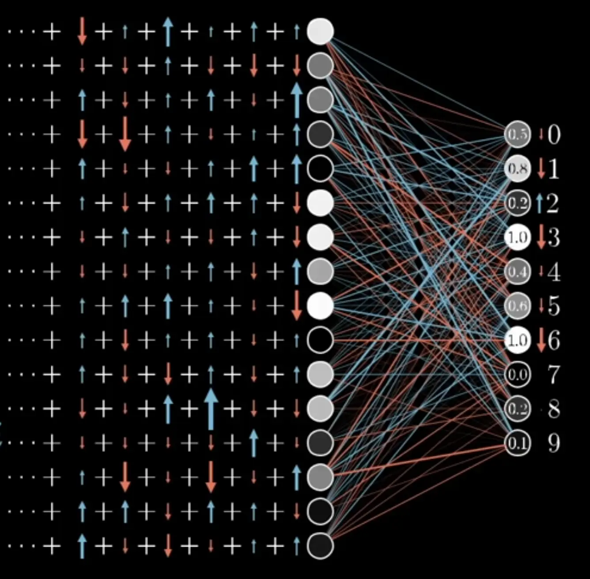
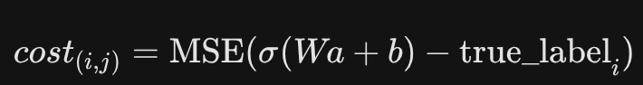
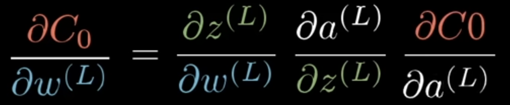

# Neural Nets / Multilayer Perceptrons
- forward feed (an already trained network) 
	- 
	-  ← 1 layer
	- ← cost of 1 training example
- training a network
	- ← total cost is just a function of  j (the space of all possible weights & biases). how to minimize it wrt j? find its negative gradient, take a small step, repeat. AKA backprop
	- every neuron in the final layer has some desire to be nudged up or down by a small or large amount. so just sum up the opinions of all the neurons
	- 
	- iterative over all training examples over and over until converge to minimum
	- okay, but how to find the direction of that "small step?"
	- 
	- the cost is just the composition of 3 functions→  the chain rule
	- 

# CNNs
- pure math defn
	- 
	- conv(n,m) = n+m-1
- key computation
	- 
	- convolution(image x, kernel y) = pad image with 0's, slide y along it, take sum-products
		- technically "same" convolution (start with middle of kernel lined up with images 1st coordinate)
- forward feed
	- 
	- apply kernels to look for more-and-more complex features in less-granular grids of original image
	- then just flatten the map of final features, and run a regular predictive MLP on it

# RNNs 
- feed-forward
	- 
	- 
	- single hidden state h,
	- E = embedding matrix
	- V, U, W = translating between new word, hidden states, prev hidden states, and output pred
- training network
	- 
	- jsut need to know these gradients, use backprop
- LSTMs and GRUs were small improvements over RNNs but irrelevant now. just used a better hidden state that allows understanding to "survive vanishing" through non-informative words / many dilutions of new information

# Why did transformers surpass RNNs?
1. representation quality. RNNs only kept a single hidden state, degraded in meaning after many sequential transformations.   
2. parallel computing. every tokens attention can happen simultaenously, unleashing the parallel computing powers of GPUs. RNNs must process the sentence in serial.  
  
NOT reason (surprisingly).  mathematics of prediction. the actual prediction power from MLPs was already around for decades, we just needed a better way to store the meanings of sentences in numbers.