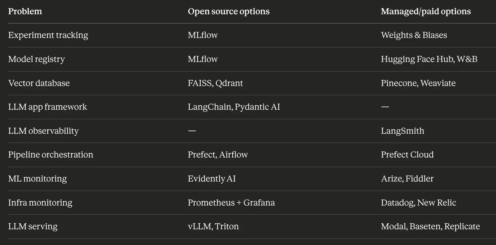

# Organizing our models
- DVC
	- like git for weights instead of code. 
- W&B
	- experiment tracking. for each training run, track metrics, hyperparameters, artifacts
	- dashboards to comapre runs and visualize loss curves
- MLflow
	- open-source version of weights&biases.
	- leans slightly more towards model registry (finished polished models) instead of experiment tracking (exploratory, development)

# Developing a model
- Hugging Face
	- model hub
		- hosting pretrained models. the github of ml models
	- transformers library
		- python library/api to use those models
	- tokenizers, datasets, evaluation libraries
		- supporting tools besides the models themselves
- LangChain
	- popular framework for building apps on top of a llm model
	- abstracts common operations like chaining llm calls, connecting to data sources, managing memory
	- abstractions always hide details and make some things harder for those who want to pop up the hood and peek inside for detailed special cases
- LangSmith
	- debugging tool for langchain, distributing tracing for llm-based apps
	- OpenTelemetry is the more general tool for this, untied to langchain specifically
- LangGraph
	- complex agent workflows as a graph
	- nodes are llm calls / tool calls, edges are control flow between them
- PydanticAI
	- enforcing inputs and outputs structure at every step for cleaner more debuggable code
- RAGAS
	- evaluation framework specifically for RAG

# Serving the model
- FastAPI
	- standard way to give an HTTP endpoint to your model
	- async I/O. server can do other requests while waiting for another to finish.
- Triton
	- NVIDIA's inference server. 
	- handles dynamic batching, concurrent models, etc.
	- for more serious production workloads than fastAPI
- TensorRT
	- takes a trained model and compiles it to be faster on a specific GPUs architecture
	- 2-10x faster than native uncompiled pytorch
- vLLM
	- serving framework which handles continuous batching and paged attention
	- alternative to triton
- Redis
	- caches frequent read/writes at the application level
		- your application pre-pends every user prompt with the same system prompt
		- need to store meta-data about this users conversation somewhere (rate, usage)
		- frequent calls to external APIs like weather, stocks, etc
		- history of previous prompts and responses in a conversation

# Orchestration
- Prefect
	- successor to airflow
	- workflow and pipeline orchestration
		- scheduling, retries, logging, monitoring
- K8s
	- container orchestration
	- most cloud providers have managed kubernetes versions (AKS, EKS, GKE)

# Observability
- Prometheus
	- scraping your apps HTTPS endpoint to see metrics as a time series
	- requests, latency, memory usage, errors etc
- Grafana
	- dashboards for prometheus, almost always used together
- OpenTelemetry
	- more in-depth metrics and logs than promometheus
- EvidentlyAI
	- monitor model drift, model performance
- StreamLit
	- makes a web UI frontend for ml apps. 
	- not for production / user-facing apps, but demonstrating things internally

# Vector Databases
 - doing KNN over 100 million document embeddings infeasible
	 - IVF
		 - replace clusters of vectors with just their centroid
		 - stack layers of this
	 - HNSW
		 - build a graph over vectors with edges connecting approximate neighbors
		 - used by qdrant and most modern vector dbs
	 - product quantization
		 - compress vectors into smaller representations
		 - combine with IVF
 - need to store/sort/filter metadata besides its semantic embedding (dates, tags)
 - concurrent read/writes is difficult
 - 3 main ones
	 - FAISS
		 - facebook, not actually a db, doesnt persist, no server
		 - good for small apps
	 - Pinecone
		 - paid option
		 - fully managed / no infra to manage
	 - Qdrant
		 - open source option
		 - can be both self-hosted and on cloud
		 - strongest choice right now

